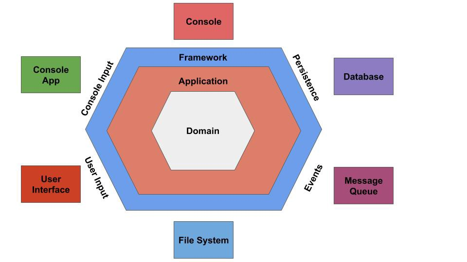

# Django Rest Framework challenge.

## Challenge logic
Create a REST API using DJANGO REST FRAMEWORK, which provides the following basic and limited functionality of an Ecommerce.

See the [challenge requirements](instructions_challenge.md).

## Repository
The code for this challenge is located in the following [GitHub repository](https://github.com/VulturARG/clicOH-challenge/tree/development) in the `development` branch.

## Implementation
See the [implementation instructions](implementation_instructions.md).

For the implementation I create a [kanban project](https://github.com/VulturARG/clicOH-challenge/projects/1) in GitHub projects.
The requirements were written as different [issues](https://github.com/VulturARG/clicOH-challenge/issues),
which were closed with the realization of each requirement. This is automatically reflected in the kanban project.

## Production server
```
luisbriones.pythonanywhere.com
```
## Design criteria
It was taken as a design criterion to separate the business logic from the implemented framework. In this case, Django Rest Framework.

For this, the concept of hexagonal architecture or ports and adapters was used.

It consists of having all the business logic in a domain that does not depend on anything external to it.
The business logic is found in the different services within the domain.
Communication with the outside is done through ports, which are abstract classes. They are commonly called repositories.
These ports are implemented in adapters within the framework, thus achieving a dependency inversion.

This allows, among other advantages, to test the business logic without having to depend on an external implementation.
Mocks of the different classes can be created without problems.

### Scheme of the hexagonal architecture.

